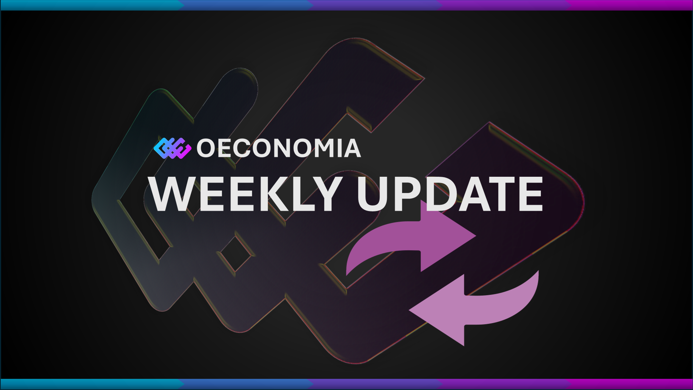

# Oeconomia Devlog: Week 14, 2026

## Summary
A new product joined the ecosystem: the Oeconomia Twitter Agent was built from scratch and brought to feature-complete status in a single sprint. This automated marketing system generates branded tweets via Claude API, creates custom images with DALL-E 3, watermarks them with the OEC logo, uploads to Supabase Storage, and posts to Twitter on a configurable schedule. A React dashboard was built alongside it for monitoring and control. 6 commits across 1 repository.

## Completed

### Smart Contracts
- None this week

### Frontend / DApp
- **Twitter Agent Dashboard:** Built a full React dashboard with Overview, Posts, Image Queue, and Controls tabs for monitoring the agent (b72e3db)
- **Twitter Agent Dashboard:** Added pause/resume controls and engagement metrics display (b72e3db)

### Infrastructure / Tooling
- **Twitter Agent:** Initial build with Claude API content generation, Tweepy Twitter posting, APScheduler for automated scheduling, and Supabase integration for state and post logging (2b7703e)
- **Twitter Agent:** Added DALL-E 3 image generation with Oeconomia brand style anchor to prevent generic crypto imagery (676dc52, b72e3db)
- **Twitter Agent:** Integrated Supabase Storage for image uploads with public URL tracking in the dashboard (676dc52)
- **Twitter Agent:** Added OEC logo watermark overlay on all generated images with proper aspect ratio preservation, configurable placement (corner or centered) (ab4d38b, d038a63)
- **Twitter Agent:** Refined DALL-E prompts to use abstract-only imagery (organic forms, light particles, aurora waves) after discovering negative instructions ("don't generate logos") made DALL-E produce more logos (1f9fd8b)

### Documentation
- None this week

## In Progress
- Twitter Agent brand schema expansion (protocol-specific colors, topics, time-of-day rules)
- Presale contract development (pre-mainnet phase)

## Issues Encountered & Resolved
- **DALL-E generating crypto logos despite instructions not to:** Negative prompt instructions ("NEVER include cryptocurrency logos") had the opposite effect — DALL-E fixated on the forbidden concepts. Resolved by switching to positive-only prompt strategy: describe what you want (organic flowing forms, light particles, nebula clouds) without mentioning what you don't want (1f9fd8b).
- **Logo watermark squished to square:** The OEC logo (1928x1107) was being force-resized to a square, distorting the image. Fixed by preserving the original aspect ratio during resize (d038a63).

## Decisions Made
- **Claude API for content generation:** Chose Claude over GPT-4 for tweet generation because the brand voice system prompt and structured JSON output work reliably with Claude's instruction-following. Deduplication checks against the last 30 days of posts using a 50-character prefix match.
- **DALL-E 3 for image generation with brand anchor:** Every image prompt gets a style anchor prepended that describes the Oeconomia visual identity (deep space, flowing energy, gold/cyan/magenta palette). This ensures visual consistency without manual art direction per post.
- **Positive-only DALL-E prompts:** After the "negative instruction paradox" where telling DALL-E not to generate logos made it generate more logos, switched to a purely descriptive approach. Describe the desired scene (abstract, atmospheric, organic) without any references to what should be excluded.
- **Supabase for agent state and image storage:** The agent stores its operational state (running/paused, last post time, next scheduled posts) in Supabase alongside the post log and image uploads. This means the React dashboard can read everything from one source and the agent is stateless between runs.

## Next Week Goals
- Expand brand schema with protocol-specific topics and colors
- Configure posting schedule and go live (switch DRY_RUN to false)
- Monitor first live posts and engagement metrics
- Continue presale contract development

## Metrics (if applicable)
- Testnet transactions: ongoing
- Contracts deployed: 0 this week
- GitHub commits: 6 across 1 repository (oeconomia-twitter-agent)
